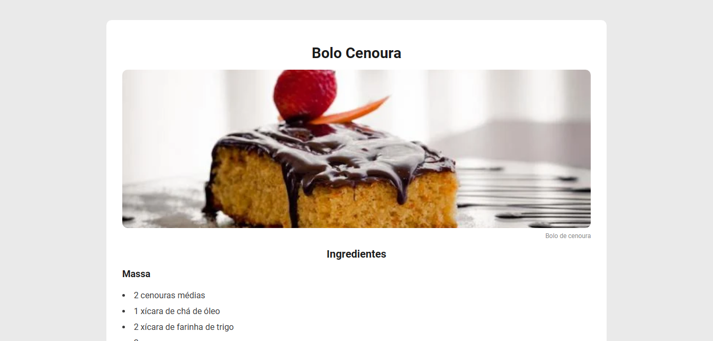

<h1 align="center"> Receitas </h1>

Discovery é programa gratuito da Rocketseat  

  <a href="#-tecnologias">Tecnologias</a>&nbsp;&nbsp;&nbsp;|&nbsp;&nbsp;&nbsp;
  <a href="#-projeto">Projeto</a>&nbsp;&nbsp;&nbsp;|&nbsp;&nbsp;&nbsp;
  <a href="#memo-licença">Licença</a>

  

 

  

## 🚀 Tecnologias

Esse projeto foi desenvolvido com as seguintes tecnologias:

- HTML e CSS
- Git e Github

## 💻 Projeto

Receitas é um projeto do curso Discovery da Rocketseat afim de desenvolver prática e fixação do conteúdo de HTML e CSS.

## 📋 Licença

Esse projeto está sob a licença MIT.

---

Feito com ❤️ by Felipe Destro com aulas da Rocketseat